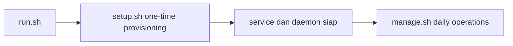

# Xray Core Discord

> Auto setup + menu operasional harian untuk Xray-core di VPS Linux.


`setup.sh` dipakai sekali untuk provisioning. `manage.sh` dipakai terus untuk operasi harian.  
Untuk automasi dari Discord, tersedia bot standalone (`bot-discord/`) dengan interaksi tombol dan modal.

[Quick Install](#quick-install-root) | [Fitur Utama](#fitur-utama-highlight) | [Fitur manage.sh](#fitur-unggulan-managesh) | [Bot Discord](#fitur-bot-discord-standalone) | [Troubleshooting](#troubleshooting-cepat)

## Kenapa Project Ini
| Nilai Utama | Penjelasan Singkat |
|---|---|
| Cepat dipakai | Satu command install, lanjut operasi lewat menu interaktif |
| Operasional terpusat | User, quota, speed, routing, domain, dan security di satu panel |
| Aman untuk runtime changes | Ada validasi config, lock file, dan pemisahan setup vs daily operations |
| Ramah admin | Status realtime server tampil di header menu utama |

## Fitur Utama (Highlight)
- One-time provisioning lengkap via `setup.sh`: Xray, Nginx, TLS, WARP, daemon runtime.
- Operasional harian terpusat via `manage.sh` menu 1-9 (status, user, quota, network, security, maintenance).
- Bot Discord standalone dengan UX interaktif tombol/modal (`/panel` sebagai entry point minimal).
- Installer bot terpisah (`install-discord-bot.sh`) dengan mode menu + quick setup all-in-one.
- Deploy source bot memakai verifikasi checksum archive sebelum extract (lebih aman dari archive corrupt/tampered).

## Quick Install (Root)
```bash
bash <(curl -fsSL https://raw.githubusercontent.com/superdecrypt-dev/xray-core_discord/main/run.sh)
```

`run.sh` akan:
1. Clone repo
2. Install command `manage` ke `/usr/local/bin/manage`
3. Menjalankan `setup.sh`

## Alur Operasional


## Struktur File
| File | Peran |
|---|---|
| `setup.sh` | One-time setup dari nol sampai service aktif |
| `manage.sh` | Menu operasional harian (runtime changes) |
| `run.sh` | Bootstrap installer cepat |
| `install-discord-bot.sh` | Installer bot Discord standalone (menu + quick setup) |

## Fitur Unggulan `manage.sh`
`manage.sh` adalah pusat kontrol runtime untuk pekerjaan harian admin.

### Peta Menu
```text
Main Menu
  1) Status & Diagnostics
  2) User Management
  3) Quota & Access Control
  4) Network Controls
  5) Domain Control
  6) Speedtest
  7) Security
  8) Maintenance
  9) Install BOT Discord
  0) Exit
```

Header realtime di Main Menu menampilkan:
- `SYSTEM OS`, `RAM`, `UPTIME`
- `IP VPS`, `ISP`, `COUNTRY`
- `DOMAIN`, `TLS EXPIRED`, `WARP STATUS`
- Jumlah akun: `VLESS | VMESS | TROJAN`

### Ringkasan Fitur Per Menu
| Menu | Fokus Operasional | Dampak |
|---|---|---|
| `1) Status & Diagnostics` | Cek status `xray/nginx`, daemon, TLS, listener, validasi config | Diagnosa cepat saat ada gangguan |
| `2) User Management` | Add, delete, set expiry, list user | Lifecycle akun harian lebih efisien |
| `3) Quota & Access Control` | Quota, block, IP limit, speed limit per user | Kontrol abuse lebih presisi |
| `4) Network Controls` | Egress direct/warp/balancer, adblock geosite, DNS, WARP tier | Routing fleksibel sesuai kebutuhan |
| `5) Domain Control` | Set domain + issue cert, cek status cert/key | Manajemen domain dari satu menu |
| `6) Speedtest` | Jalankan Ookla speedtest + cek versi | Verifikasi performa jaringan cepat |
| `7) Security` | TLS ops, fail2ban, hardening status | Meningkatkan keamanan operasional |
| `8) Maintenance` | Restart service/daemon, tail log, wireproxy status | Maintenance tanpa keluar panel |
| `9) Install BOT Discord` | Launcher installer bot standalone (`/usr/local/bin/install-discord-bot`) | Setup, deploy, update, restart, dan uninstall bot dari menu |

### Detail Penting: `3) Quota & Access Control`
```text
1) View JSON
2) Set Quota Limit (GB)
3) Reset Quota Used (set 0)
4) Manual Block/Unblock (toggle)
5) IP Limit Enable/Disable (toggle)
6) Set IP Limit (angka)
7) Unlock IP Lock
8) Set Speed Download (Mbps)
9) Set Speed Upload (Mbps)
10) Speed Limit Enable/Disable (toggle)
0) Back
```

Status detail akun menampilkan:
- Quota limit, quota used, expired date
- Status IP limit dan nilai maksimum
- Lock reason: `manual`, `quota`, `ip_limit`
- Speed download/upload + status speed limiter

### Detail Penting: `4) Network Controls`
- Egress mode: `direct`, `warp`, `balancer`
- Balancer strategy, selector, observatory tuning
- Adblock geosite custom (`ext:custom.dat:adblock`) dengan mode:
  `blocked`, `direct`, `warp`, `balancer (direct+warp)`, `disable`
- WARP controls: global, per-user, per-protocol inbound, per-domain/geosite
- WARP tier management: `Target Tier` dan `Live Tier`
- DNS settings + advanced DNS editor

## Fitur Bot Discord (Standalone)
Bot Discord berada di `bot-discord/` dan sengaja berdiri sendiri (tidak mengeksekusi `manage.sh`).

Highlight kemampuan:
- UX Discord: dominan button/modal, slash command minimal (`/panel`).
- Cakupan menu mengikuti pola `manage.sh` (menu 1-9) agar familiar untuk admin.
- Arsitektur terpisah gateway TypeScript (`discord.js`) + backend Python (`FastAPI`).
- Role-based access lewat `DISCORD_ADMIN_ROLE_IDS` dan `DISCORD_ADMIN_USER_IDS`.
- Deploy produksi via `install-discord-bot.sh` ke `/opt/bot-discord` + systemd service terpisah.

## Ringkasan `setup.sh` (One-Time)
`setup.sh` menangani provisioning awal end-to-end:
1. Install dependency OS
2. Install Nginx dari repo resmi `nginx.org`
3. Install Xray-core + geodata updater + custom geosite adblock (`custom.dat`)
4. Generate modular config di `/usr/local/etc/xray/conf.d/`
5. Issue TLS via acme.sh (standalone atau `dns_cf_wildcard`)
6. Install WARP stack (`wgcf` + `wireproxy`)
7. Install daemon runtime: `xray-expired`, `xray-quota`, `xray-limit-ip`, `xray-speed`
8. Apply baseline hardening (fail2ban, sysctl/BBR, swap, ulimit, logrotate)
9. Install speedtest via snap

Catatan custom geosite adblock:
- Sumber: `https://github.com/superdecrypt-dev/custom-geosite-xray/raw/main/custom.dat`
- Lokasi install: `/usr/local/share/xray/custom.dat`
- Aktivasi routing dilakukan dari `manage.sh` -> `4) Network Controls` -> `6) Adblock (Custom Geosite)`

## Daemon Runtime
| Service | Fungsi |
|---|---|
| `xray-expired` | Hapus user expired dari inbounds/routing |
| `xray-quota` | Lock user saat quota habis |
| `xray-limit-ip` | Lock user saat IP aktif melebihi limit |
| `xray-speed` | Terapkan speed policy per user (tc + nft) |

Cek cepat:
```bash
systemctl status xray xray-expired xray-quota xray-limit-ip xray-speed --no-pager
```

## Lokasi Data Penting
```text
/usr/local/etc/xray/conf.d/
/etc/nginx/conf.d/xray.conf
/opt/cert/fullchain.pem
/opt/cert/privkey.pem

/opt/account/{vless,vmess,trojan}/
/opt/quota/{vless,vmess,trojan}/
/opt/speed/{vless,vmess,trojan}/

/etc/xray-speed/config.json
/var/lib/xray-speed/state.json
/var/lib/xray-manage/
/var/log/xray-manage/
```

## Menjalankan Menu
```bash
manage
```

Atau:
```bash
/usr/local/bin/manage
```

## Troubleshooting Cepat
| Kasus | Tindakan |
|---|---|
| `Jalankan sebagai root` | Jalankan dengan `sudo` atau login root |
| TLS issue gagal (dns_cf) | Pastikan token Cloudflare valid, scope DNS edit + zone read |
| Speed limit tidak terasa | Cek service `xray-speed` dan status apply policy |
| User tidak auto-lock/unlock | Cek service `xray-quota` + `xray-limit-ip` |
| `Target Tier` unknown | Jalankan switch tier (Free/Plus) sekali agar target tersimpan |

---
Dokumentasi ini sengaja menempatkan `manage.sh` sebagai pusat workflow harian admin.
